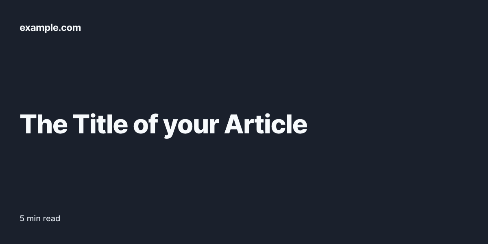

# Generate Open Graph Images

screeenly can also be used to generate images from your own HTML code.

In this example we're creating an Open Graph Image for an article for our imaginary blog.



We're using the utility CSS framework [Tailwind CSS](https://tailwindcss.com/) to layout and design the image. The text in the image is set in [Inter](https://rsms.me/inter/).

The following is all the HTML code we need to create the image above. You can find an interactive example on [codepen.io](https://codepen.io/stefanzweifel/pen/MWyoEwN?editors=1000).&#x20;

```html
<link rel="stylesheet" type="text/css" href="https://cdnjs.cloudflare.com/ajax/libs/tailwindcss/1.7.0/tailwind.min.css">
<link rel="stylesheet" type="text/css" href="https://rsms.me/inter/inter.css">

<style>
#container {
  font-family: 'Inter';
  width: 1200px;
  height: 600px;
}
</style>

<section id="container" class="flex flex-col justify-between p-12 bg-gray-900">
  <h2 class="text-2xl font-bold leading-10 tracking-tight text-gray-100">example.com</h2>
  <h1 class="text-6xl font-extrabold tracking-tight text-gray-100">The Title of your Article</h1>
  <footer class="text-gray-300 text-xl font-medium">
    5 min read
  </footer>
</section>
```

You can also try this example out in [the playground](https://3.screeenly.com/playground). Import the following API payload and the hit "Run Playground" to generate the image.

```json
{
    "file_type": "jpg",
    "window_width": "1200",
    "window_height": "600",
    "timeout": 10,
    "css_media_type": "screen",
    "html": "<link rel=\"stylesheet\" type=\"text\/css\" href=\"https:\/\/cdnjs.cloudflare.com\/ajax\/libs\/tailwindcss\/1.7.0\/tailwind.min.css\">\n<link rel=\"stylesheet\" type=\"text\/css\" href=\"https:\/\/rsms.me\/inter\/inter.css\">\n\n<style>\n#container {\n  font-family: 'Inter';\n  width: 1200px;\n  height: 600px;\n}\n<\/style>\n\n<section id=\"container\" class=\"flex flex-col justify-between p-12 bg-gray-900\">\n  <h2 class=\"text-2xl font-bold leading-10 tracking-tight text-gray-100\">example.com<\/h2>\n  <h1 class=\"text-6xl font-extrabold tracking-tight text-gray-100\">The Title of your Article<\/h1>\n  <footer class=\"text-gray-300 text-xl font-medium\">\n    5 min read\n  <\/footer>\n<\/section>",
    "delay": "1000"
}
```

***

By using Tailwind's flexbox utility classes we can position the name of our website, the title of the article and the reading time nicely on the image. We've also written some basic CSS to set the `font-family` to Inter and define a width and height for the image.

The API request to screeenly would look like this:

```shell
curl --request POST \
  --url https://3.screeenly.com/api/v1/shots \
  --header 'accept: application/json' \
  --header 'authorization: Bearer <token>' \
  --header 'content-type: application/x-www-form-urlencoded' \
  --data 'html=<link rel="stylesheet" type="text/css" href="https://cdnjs.cloudflare.com/ajax/libs/tailwindcss/1.7.0/tailwind.min.css">
<link rel="stylesheet" type="text/css" href="https://rsms.me/inter/inter.css">

<style>
#container {
  font-family: '\''Inter'\'';
  width: 1200px;
  height: 600px;
}
</style>

<section id="container" class="flex flex-col justify-between p-12 bg-gray-900">
  <h2 class="text-2xl font-bold leading-10 tracking-tight text-gray-100">example.com</h2>
  <h1 class="text-6xl font-extrabold tracking-tight text-gray-100">The Title of your Article</h1>
  <footer class="text-gray-300 text-xl font-medium">
    5 min read
  </footer>
</section>' \
  --data file_type=jpg \
  --data window_height=600 \
  --data window_width=1200 \
  --data delay=1000
```

Notice the `window_height` and `window_width` parameters. They equal the values in the `<style>`-tag in our HTML code. This ensure that our image will have the expected dimensions.

The `delay` parameter is set to 1000 milliseconds to ensure that the external assests for Tailwind CSS and Inter are loaded and parsed by the browser.

Again, if you would like to see an interactive example, check out [the playground](https://3.screeenly.com/playground).
